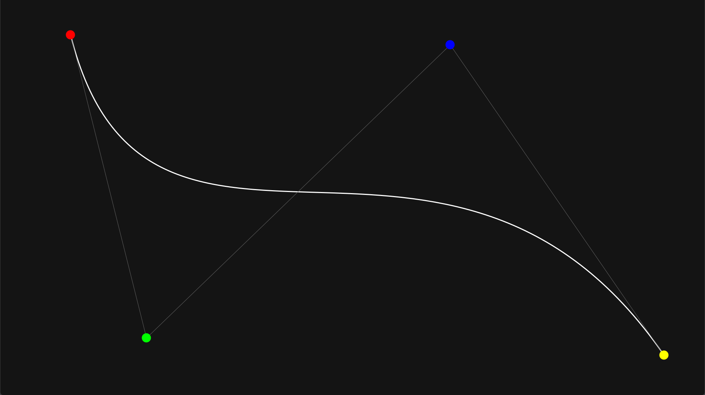

### 1.1 Was sind Bezierkurven

Der französiche Ingenieur Pierre Étienne Bézier, geboren 1910 in Paris, entwickelte in den 60er Jahren eine Gestaltungsmöglichkeit von Karosserieformen für seinen damaligen Arbeitgeber Renault. Seit 1968 ist sein System zur "Freiform Kurven und Oberflächen Design" ("interactive free-form curve and surface design and 3D milling for manufactoring clay models and masters"{A2}) bei Renault in Nutzung.

Auch der französiche Mathematiker Paul de Faget de Casteljau, geboren 1930, beschäftigte sich im 20ten Jahrhundert mit der Modelierung von Kurven und Flächen{A3}. Als Physiker bei Citroën arbeitete er ebenfalls an der Modellierung von Karosserien mithilfe von Bezierkurven. Unabhängig von Pierre Étienne Bézier entwickelte er den nach ihm bennanten Casteljau Algorithmus zur Beschreibung von Bezierkurven.

Beide entwickelten das Konzept unabhängig voneinander, wobei der Name der Bezierkurve sich durchsetzte, wohingegen der nach Casteljau benannte Algorithmus die bekannteste Darstellungsform ist.

Eine Bezierkurve wird durch mindestens zwei sogenante Kontrollpunkte (sowohl 2Dimensional wie auch 3Dimensional) beschrieben, welche den Verlauf der Kurve beeinflussen. Die Kontrollpunkte benannt \\(P_{0}\\) bis \\(P_{n}\\), wobei '\\(n+1\\)' den Grad der Kurve angibt. Der erste und letzte Kontrollpunkt sind die Endpunkte der Kurve und berühren diese somit, alle weiteren Kontrollpunkte \\(P_{1} - P_{n-1}\\), soweit vorhanden beeinflussen den Verlauf der Kurve, liegen aber, in der Regel nicht auf dieser.

Demo 1.1.1 Bezierkurve mit 4 Kontrollpunkten (BezierkurveGrad4)

Mathematisch wird die Kurve \\(B\\) in abhängigkeit von \\( t \\) als \\(B(t)\\) angegeben, wobei \\( 0\leq{}t\leq{}1 \\) ist. Und es gilt \\( B(0)=P_{0} \\) und \\( B(1)=P_{n} \\) . Bei \\( n \\) Kontrollpunkten gilt somit{A13}: 

$$ B(t) = \sum_{i=0}^{n}{^nC_{i} (1-t)^{n-i} t^i P_{i}} , 0 \leq t \leq 1 $$

Oder auch:

$$ B(t) = \sum_{i=0}^{n}{\frac{n!}{i! (n - i)!} (1-t)^{n-i} t^i P_{i}} , 0 \leq t \leq 1$$

Hier lässt sich das vorangegangene Verhalten gut erkennnen bei kleinem \\( t \\) setzt sich \\( P_{0} \\) durch und bei großem \\( t \\) setzt sich \\( P_{n} \\) durch.