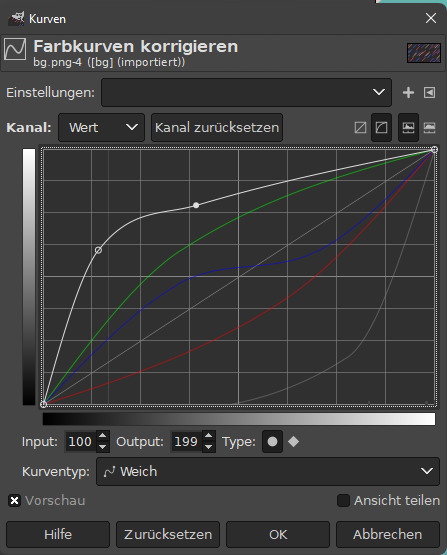
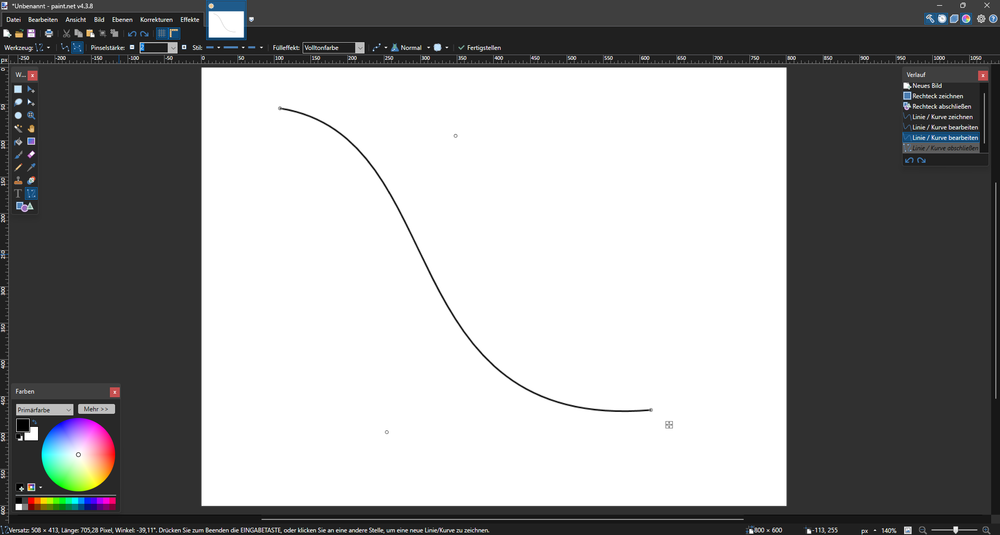
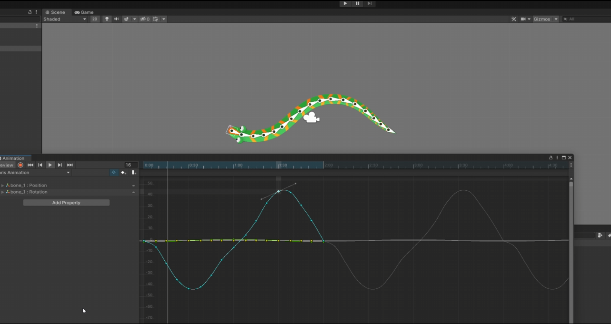
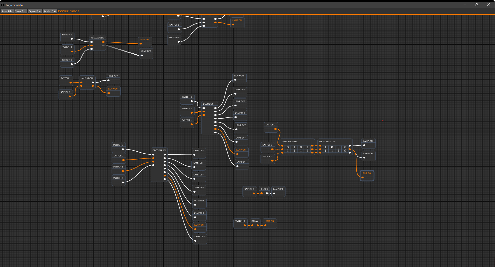
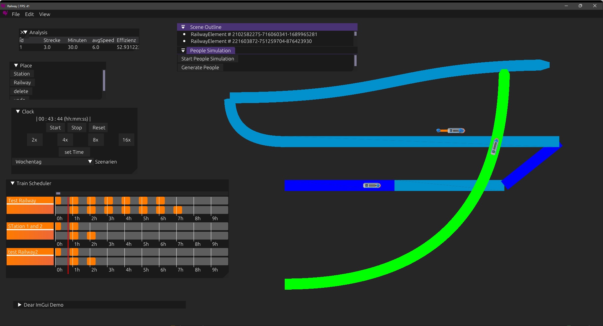

### 1.2 Wo findet man Bezierkurven

Heutzutage sind Bezierkurven in vielen Bereichen zu finden. Insbesondere in der Softwareindustrie stolpert man an jeder Ecke über die Verwendung von Bezierkurven.

Viele Bildbearbeitungsprogramme nutzen Bezierkurven um Farbkorrekturen zu ermöglichen oder um Kurven einzufügen. \
In Gimp{A4} zum Beispiel lassen sich die einzelnen Farbkanäle, Rot, Grün, Blau und Alpha/Transparenz mithilfe einer Bezierkurve anpassen. 

Bild 1.2.1 Farbkurveneditor Gimp

Aber auch in Programmen wie Paint.NET{A5} gibt es Tools, die einem Erlauben mit Hilfe von Bezierkurven Grafiken zu erstellen. Durch das Bewegen von zwei Konrollpunkten lässt sich eine Kurve erstellen, welche von einem Punkt zum anderen verläuft und durch weitere Kontrollpunkte beeinflusst wird.

Bild 1.2.2 Bezierkurve in Paint.NET

Beim Erstellen von Animationen und dem Beschreiben von Bewegungen werden Bezierkurven genutzt um flüssige Bewegungsabläufe und Übergänge zu erstellen, wie zum Beispiel im Animtionseditor der Spieleengine Unity{A14}.

Animation 1.2.3 Animierte Schlange in Unity

Auch viele Mindmap oder Graphing Tools nutzen Bezierkurven um Beziehungen zwischen Elementen kenntlich zu machen. Wie auch in diesem Bild aus einem von mir erstellten Nachbau des Lehrprogramms LogikSim{A6}, mit Hilfe dessen man Stromschaltkreise simulieren kann.

Bild 1.2.4 LogikSim Clone{A7}

Das kürzlich im Informatikunterricht enstandene Softwareprojekt zur Effizienzoptimierung von Bahnverbindungen und Zugstrecken nutzt Bezierkurven um den Verlauf der Schienen darzustellen{A15}.

Bild 1.2.5 Railway Informatikprojekt

Was viele nicht wissen, auch bei Schriftarten kommen Bezierkurven zum Einsatz. \
Dateiformate wie zum Beispiel TrueType{A8} oder OpenType{A9} nutzen Bezierkurven um die Umrandung (outline) einzelner Buchstaben mathematisch zu beschreiben. Dies verhindert, dass die Buchstaben bei Änderung der Schriftgröße nicht unscharf oder verschwommen werden. Auf Abruf kann für jede Schriftgröße vom entsprechenden Programm zur Laufzeit das passende Bild der Buchstaben generiert werden. Dieses Verfahren wird Fontrasterization gennant{A10}.

Bild 1.2.6 Font Rasterization{A11}

