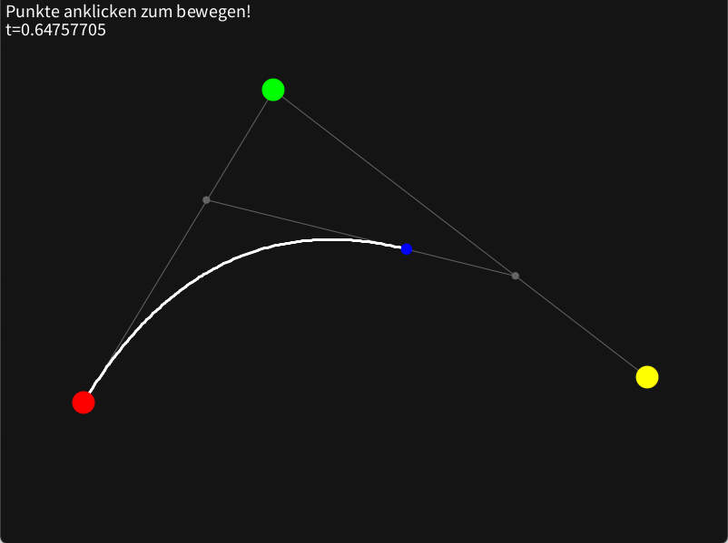

## 2. Zeichnen von Bezierkurven

Wir haben gesehen, dass Bezierkurven in vielen Bereichen Anwendung finden und jeder von uns sie schon einmal verwendet hat, auch wenn es nur durch das Schreiben eines Textes in Microsoft Word{A16} war. Nun wollen wir jedoch nicht mehr anschauen wo wir Bezierkurven finden, sondern wir wollen selber Bezierkurven zeichnen. Vorerst wollen wir uns hierzu mit dem De Casteljau's Algorithmus beschäftigen.

### 2.1 Nutzung des De Casteljau's Algorithmus

Der nach Paul de Casteljau benannte Algorithmus, ist ein rekursiver Algorithmus zur näherungsweisen Auswertung von Bezierkurven, mithilfe linearer Interpolation. Welche durch theoretische unendliche Verfeinerung die Bezierkurve formt.

> Linear interpolation is the simplest method of getting values at positions in between the data points. The points are simply joined by straight line segments. Each segment (bounded by two data points) can be interpolated independently. The parameter mu defines where to estimate the value on the interpolated line, it is 0 at the first point and 1 and the second point. For interpolated values between the two points mu ranges between 0 and 1. Values of mu outside this range result in extrapolation. \
>-- Paul Bourke{A12}

#### 2.1.1 Beispiel mit zwei Kontrollpunkten

Zur Interpolation zweier Zahlen wird folgenede Funktion genutzt:
$$ lerp(a,b,t) = (1-t)*a + t * b, 0 \leq t \leq 1 $$

Und eingesetzt:

$$ lerp(t) = (1-t)*P_{0} + t * P_{1} $$

Schauen wir uns nun die Bezierfunktion mit zwei Kontrollpunkten an:
$$B(t) = \sum_{i=0}^{n} \frac{n!}{i! (n - i)!} (1-t)^{n-i} t^i P_{i} $$

$$ B_{2}(t) = \sum_{i=0}^{1} \frac{1!}{i! (1 - i)!} (1-t)^{1-i} t^i P_{i} = [\frac{1!}{0! (1 - 0)!} (1-t)^{1-0} t^0 P_{0}] + [\frac{1!}{1! (1 - 1)!} (1-t)^{1-1} t^1 P_{1}] $$
$$ = [(1-t)P_{0}] + [tP_{1}] = (1-t)P_{0} + t*P_{1} $$

Also ist eine Bezierkurve des zweiten Grades gleich einer linearen Interpolation.


<p style="text-align: center; font-size: 1.6rem;">Demo 2.1.1 Lineare Bezierkurve abhängig von t (LinearBezierAnimatedT)</p>


Es lässt sich erkennen, dass der blaue Punkt von \\(P_{0}\\) bei \\(t=0\\) zu \\(P_{1}\\) bei \\(t=1\\) wandert.
Also lässt sich eine lineare Bezierkurve zeichnen, indem man kleine Intervalle von \\(t\\) berechnet und verbindet:
```cs
void drawLinearBezier(){
    var step = 0.01;
    var t = 0;
    while(t <= 1){
        line(lerp(P0,P1,t), lerp(P0,P1,t+step));
        t += step;
    }
}

void line(Point p0, Point p1); // Implementation not included
Point lerp(Point a, Point b, float t); // Implementation not included 
``` 
Und sich so durch einen immer kleineren "step" der Originalkurve annähert.

#### 2.1.2 Beispiel mit drei Kontrollpunkten

Um nun eine Bezierkurve mit mehr als zwei Kontrollpunkten zu zeichnen, gehen wir nach dem gleichen Verfahren vor, nur dass wir diesmal zwischen drei Punkten interpolieren müssen. Dies lässt sich wie folgt verwirklichen:

$$ lerp3(a,b,c,t) = lerp(\color{yellow}{lerp(a,b,t)},\color{red}{lerp(b,c,t)},t) $$

Oder mit Punkten:

$$ lerp3(t) = lerp(\color{yellow}{lerp(P_{0},P_{1},t)},\color{red}{lerp(P_{1},P_{2},t)},t) $$

Was man auschreiben kann als: 

$$ lerp3(t) = (1-t)\color{yellow}{((1-t)P_{0} + tP_{1})} + t\color{red}{((1-t)P_{1} + tP_{2})} $$

Veranschaulicht gibt dies folgenden Verlauf:


<p style="text-align: center; font-size: 1.6rem;">Demo 2.1.2 Bezierkurve mit drei Kontrollpunkten abhängig von t (QuadraticBezierAnimatedT)</p>

Das zeigt sich auch in der allgemeinen Form des Grades drei:

$$ B_{2}(t) = \sum_{i=0}^{2} \frac{2!}{i! (2 - i)!} (1-t)^{2-i} t^i P_{i} $$

$$ = [\frac{2!}{0! (2 - 0)!} (1-t)^{2-0} t^0 P_{0}] + [\frac{2!}{1! (2 - 1)!} (1-t)^{2-1} t^1 P_{1}] + [\frac{2!}{2! (2 - 2)!} (1-t)^{2-2} t^2 P_{2}]$$

$$ = (1-t)^2P_{0} + 2(1-t)tP_{1} + t^2P_{2} $$

$$ = (1-t)^2P_{0} + (1-t)tP_{1} + (1-t)tP_{1} + t^2P_{2} $$

$$ = (1-t)((1-t)P_{0} + tP_{1} ) + (1-t)tP_{1} + t^2P_{2} $$

$$ = (1-t) \color{yellow}{((1-t)P_{0} + tP_{1} )} + t\color{red}{((1-t)P_{1} + tP_{2})} $$ 


Das an zwei und drei Kontrollpunkten gezeigte Verhalten gilt auch bei unendlich vielen Kontrollpunkten.

So lässt bei Variation des t eine beliebig genaue Annäherung an die Bezierkurve bestimmen.


<p style="text-align: center; font-size: 1.6rem;">Demo 2.1.3 Bezierkurve mit drei Kontrollpunkten und großem Δt (QuadraticBezierChangingT)</p>
