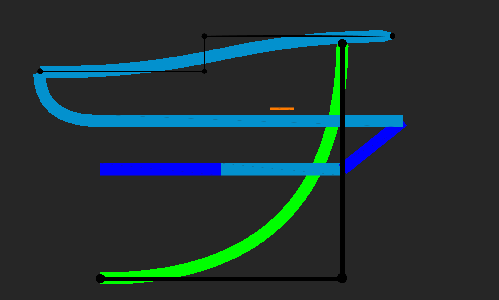

### 3.1 Anwendung

Wie schon bereits in [1.2](../chapter_1/WoFindetManBezierkurven.md) beschrieben, nutzt das Schulprojekt Railway aus dem Informatikprojekt Bezierkurven um Kurven in Bahnlinien zu erstellen darzustellen. Hierzu wird je nach Type (Kurve oder Versatz) eine Bezierkurve dritten oder vierten Grades erstellt. 


<p style="text-align: center; font-size: 1.6rem;">Bild 3.1.1 Bezierkurven Grad 3 und 4 in Railway</p>

Railway[\\(^{A15}\\)](../links.md#a15)

Die Strecke wird durch festgelegte Punkte am Anfang und am Ende eines Bahnsegments angegeben. Die weiteren ein bzw. zwei Kontrollpunkte werden vom Programm entsprechend der bereits bekannten Punkte ermittelt.

Wenn zur Laufzeit des Programmes ein neues Kurvenelement erzeugt werden soll, werden diese Punkte dem Element übergeben.
```java
public CurveForm(
    int x1, int y1, 
    int x2, int y2, 
    int x3, int y3, 
    float width, 
    Color color) {
        // Weiterer Initlialisierungs Code
    }
```

Anschließend werden mit Hilfe des De Casteljau Algorithmus 100 Punkte auf der Kurve berechnet und mit Linien verbunden, welche statisch an die Grafikkarte gesendet werden, um dort zum Rendern benutzt zu werden.

```java
origin_x = new float[(int) density];
origin_y = new float[(int) density];
for (int i = 0; i < density; i++) {
    float t = i/(density * 1.0f); // Berechne t für die i-te Iteration
    origin_x[i] = (1 - t)*(1 - t) * x1 + 2*t*(1-t)*x2 + (t*t) * x3; 
    origin_y[i] = (1 - t)*(1 - t) * y1 + 2*t*(1-t)*y2 + (t*t) * y3;
    // Zwischenspeichern der Punkte auf der Kurve
}

//Befüllen des Vertexarrays mit den berechneten Punkten der Linien
vertexArray = new float[density * 7 * 2];
int index = 0;
int point = 0;

//Breite der Linie durch Verschiebung der Punkte
float upper_rad1 = (float) (Math.atan2(y2- y1, x2 - x1 ) - (Math.PI / 20f));
float lower_rad1 = (float) (Math.atan2(y2- y1, x2 - x1 ) + (Math.PI / 20f));
vertexArray[index    ] = origin_x[point] + Math.cos(lower_rad1) * width;
vertexArray[index + 1] = origin_y[point] + Math.sin(lower_rad1) * width;
//[misc]
index += 7;
vertexArray[index    ] = origin_x[point] + Math.cos(upper_rad1) * width;
vertexArray[index + 1] = origin_y[point] + Math.sin(upper_rad1) * width;
//[misc]
index += 7;
point++;
for (int i = 0; i < density - 2; i++) {
    float y_dist = origin_y[point] - origin_y[point - 1];
    float x_dist = origin_x[point] - origin_x[point - 1];
    float ru = (float) (Math.atan2(y_dist, x_dist) - (Math.PI / 2.0f));
    float rl = (float) (Math.atan2(y_dist, x_dist) + (Math.PI / 2.0f));
    vertexArray[index    ] = origin_x[point] + Math.cos(rl) * width;
    vertexArray[index + 1] = origin_y[point] + Math.sin(rl) * width;
    //[misc]
    index += 7;
    vertexArray[index    ] = origin_x[point] + Math.cos(ru) * width;
    vertexArray[index + 1] = origin_y[point] + Math.sin(ru) * width;
    //[misc]
    index += 7;
    point++;
}
float upper_rad2 = (float) (Math.atan2(y3- y2, x3 - x2 ) - (Math.PI / 20f));
float lower_rad2 = (float) (Math.atan2(y3- y2, x3 - x2 ) + (Math.PI / 20f));
vertexArray[index    ] = origin_x[point] + Math.cos(lower_rad2) * (width/ 2.0f);
vertexArray[index + 1] = origin_y[point] + Math.sin(lower_rad2) * (width/ 2.0f);
//[misc]
index += 7;
vertexArray[index    ] = origin_x[point] + Math.cos(upper_rad2) * (width/ 2.0f);
vertexArray[index + 1] = origin_y[point] + Math.sin(upper_rad2) * (width/ 2.0f);
//[misc]

// Element Array Generation
```

Diese einzelnen Linien können nun mit einer simplen Kombination aus fragment und vertex Shader auf dem Bildschirm angezeigt werden.

```cpp
#type vertex
#version 330 core
layout (location=0) in vec3 aPos;
layout (location=1) in vec4 aColor;

uniform mat4 uProj;
uniform mat4 uView;

out vec4 fColor;

void main(){
    fColor = aColor;
    vec4 pos = uProj * uView * vec4(aPos, 1);
    gl_Position = pos;
}

#type fragment
#version 330 core

in vec4 fColor;

out vec4 color;

void main(){
    color = fColor;
}
```