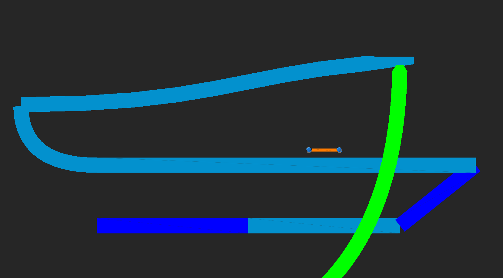

### 3.2 Ineffizienz und Schwierigkeiten in der Praxis

Beim vorangegangenen Ansatz aus [3.1](./Anwendung.md) wird die gesamte Arbeit der Bestimmung der Bezierkurve auf Seiten der CPU im vornerein berechnet und die Grafikkarte ausgehebelt, indem nur noch Linien gezeichnet werden. Dieses Vorgehen ist ungenau, da der Casteljau Algorithmus nur eine Annäherung der Kurve berechnet. Dies zeigt sich insbesondere an den Ecken der Kurven, welche auf Grund der ungleichen Verteilung der von \\(t\\) abhängigen Punkte auf der Kurve sehr harte Stufenübergänge erhalten. 


<p style="text-align: center; font-size: 1.6rem;">Bild 3.2.1 Ecken ungenauigkeit bei Bezierkurven</p>

Auch die Verwendung von Antialiasing{A17} um diese Ungenauigkeiten zu verblenden ist aufgrund des Enstehen von Überlappung der Linien nur unter hohem Aufwand möglich. 

Ein möglicher Lösungsansatz wäre es, die Berechnung der Kurve auf die GPU zu verlagern und dort nach dem De Casteljau Algorithmus für verscheidene \\(t\\) die Nähe des gerade zu berechnenden Pixels zu ermitteln, um so die Kurve darzustellen. Dies hätte den Vorteil, dass man auch im Nachhinein noch die Position der Kontrollpunkte verändern könnte, sowie basierend auf der Nähe zum berechneteten \\(t\\) auch eine Form des Antialiasing anwenden könnte um harte Übergänge zu vermeiden.

```cpp
#type fragment
#version 330 core

#define STEP 100.0
//Thickness
#define DIST 0.1

in vec2 pixelCoord;
out vec4 pixelColor;

vec3 colorBezier(vec2 pixelCoord, vec2 pos1, vec2 pos2, vec2 pos3, vec3 baseColor, vec3 bezierColor){
    vec3 color = baseColor;

    // De Casteljau Algorithmus
    for (float st = 0.; st <= STEP; st++){
        float t = st*1./STEP;
        vec2 pos = (pos1.xy - 2. * pos2.xy + pos3.xy) * t*t;
        pos += (-2.*pos1.xy + 2.* pos2.xy)*t +
        pos1.xy;
        float dist = distance(pixelCoord.xy / 100., pos.xy / 100.);
        if (dist < DIST){
            color = bezierColor;
        }
    }


    return color;
}
vec3 pointDraw(vec2 pixelCoord, vec2 pos, vec3 baseColor, vec3 pointColor){...}//SDFCircleFunc
void main()
{
    vec3 col = vec3(0, 0, 0);
    vec3 colorP1 = vec3(1, 0, 0);
    vec2 posP1 = vec2(200, 100);
    vec3 colorP2 = vec3(0, 1, 0);
    vec2 posP2 = vec2(200, 300);
    vec3 colorP3 = vec3(0, 0, 1);
    vec2 posP3 = vec2(400, 200);
    col = colorBezier(pixelCoord, posP1, posP2, posP3, col, vec3(1, 1, 1));
    col = pointDraw(pixelCoord, posP1, col, colorP1);
    col = pointDraw(pixelCoord, posP2, col, colorP2);
    col = pointDraw(pixelCoord, posP3, col, colorP3);

    pixelColor = vec4(col, 1.0);
}
```

Bei näherer Betrachtung dieser Methode unter Berücksichtigung der Funktionsweise moderner Grafikkarten und dem damit einhergehenden Leitfaden zur Vermeidung von Kontrollstrukturen und Iteration sowie Rekursion und der größtmöglichen Beschränkung auf mathematische Rechnungen, zeigt sich auch in der Praxis, dass der hier gewählte Ansatz schon bei einzelnen Kurven eine erhebliche Menge an Recheneistung benötigt und schon bei wenigen Kurven pro Frame nicht mehr realistisch verwendbar ist. Auch bleibt die Ungenauigkeit des De Casteljau Algorithmus erhalten.

Ein realistischer Lösungansatz zur exakten Berechnung und Zeichnung von Bezierkurven soll im folgenden erarbeitet werden. Um dies zu erzielen soll durch das Lösen von Funktionsgleichungen die Bestimmung ob ein Pixel \\(P\\) auf \\(B(t)\\) liegt mathematisch und ohne rekursiven Aufruf erfolgen, um so die Grafikkarte optimal zu nutzen und Effizient eine vielzahl verschiedener Bezierkuven zu zeichnen.