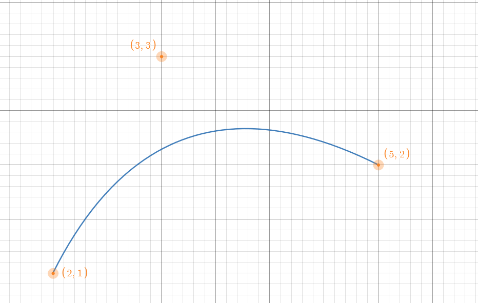
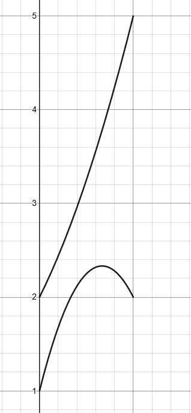
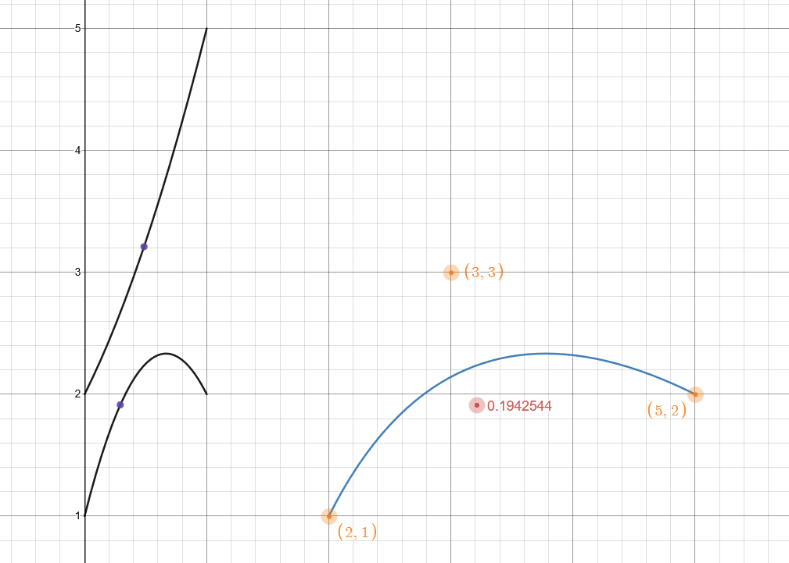

### 3.3 Mathematischer Lösungsansatz

Der mathematische Lösungsweg wird im Folgenden für eine beliebige Bezierkurve dritten Grades gezeigt. Die meisten der gezeigten Eigenschaften lassen sich jedoch auf Bezierkurven mit anderem Grad übertragen.

Als Ausgangsgleichung ziehen wir also die zuvor in [2.1.2](../chapter_2.md) hergeleitete Gleichung:

$$ B_{3}(t) = (1-t)^2P_{0} + 2(1-t)tP_{1} + t^2P_{2} $$

Da \\(P_{0}\\) - \\(P_{2}\\) Punkte mit jeweils einer \\(x\\) und \\(y\\) sind lässt sich die obige Gleichung unterteilen in eine für \\(x\\) und eine für \\(y\\):

$$ B_{x3}(t) = (1-t)^2x_{0} + 2(1-t)tx_{1} + t^2x_{2} $$
$$ B_{y3}(t) = (1-t)^2y_{0} + 2(1-t)ty_{1} + t^2y_{2} $$

Nehmen wir Besipielsweise die Punkte \\(P_{0} = (2,1), P_{1} = (3,3), P_{2} = (5,2) \\), so sieht die dazugehörige Bezierkurve wie folgt aus:

Bild 3.3.1 Bezierkurve mit festen Punkten

Die dazugehörigen Graphen von \\(x\\) und \\(y\\) sind:

Bild 3.3.2 Einzelgleichungen der Bezierkurve; x oben, y unten

Bei genauerer Betrachtung einzelner Punkte bzw. einzelner \\(t\\),  lässt sich erkennen, dass alle Punkte auf \\(B_{3}(t)\\), die gleiche \\(x\\) Koordinate in den Einzelgleichungen haben, und somit untereinander liegen.

Bild 3.3.3 Gleiche x Koordinate für t auf der Bezierkurve

Setzen wir nun \\(B(t) = T\\), wobei \\(T\\) ein beliebiger Punkt ist, für den wir Testen ob er auf \\(B(t)\\) liegt, können wir die Gleichung wie folgt für \\(t\\) lösen:

$$ B(t) = (1-t)^2P_{0} + 2(1-t)tP_{1} + t^2P_{2} = T $$

$$ (1-t)^2P_{0} + 2(1-t)tP_{1} + t^2P_{2} - T = 0 $$

$$ (1-t)(1-t) P_{0} + 2(1-t)tP_{1} + t^2P_{2} - T = 0 $$

$$ (1-2t+t^2) P_{0} + 2(1-t)tP_{1} + t^2P_{2} - T = 0 $$

$$ P_{0}-2tP_{0}+P_{0}t^2 + 2(1-t)tP_{1} + t^2P_{2} - T = 0 $$

$$ P_{0}-2tP_{0}+P_{0}t^2 + (2-2t)tP_{1} + t^2P_{2} - T = 0 $$

$$ P_{0}-2tP_{0}+P_{0}t^2 + (2t-2t^2)P_{1} + t^2P_{2} - T = 0 $$

$$ P_{0}-2tP_{0}+P_{0}t^2 + 2tP_{1}-2t^2P_{1} + t^2P_{2} - T = 0 $$

$$ P_{0} - T - 2tP_{0} + 2tP_{1} + P_{0}t^2 - 2t^2P_{1} + t^2P_{2}  = 0 $$

$$ P_{0} - T + 2tP_{1} - 2tP_{0} + P_{0}t^2 - 2t^2P_{1} + t^2P_{2}  = 0 $$

$$ P_{0} - T + t(2P_{1} - 2P_{0}) + t^2(P_{0} - 2P_{1} + P_{2})  = 0 $$

$$ t^2(P_{0} - 2P_{1} + P_{2}) + t(2P_{1} - 2P_{0}) + P_{0} - T +  = 0 $$

Mit Hilfe der Mitternachtsformel{A19} können wir nun die Gleichung, welche nun die Form \\(a x^2 + b x + c = 0\\) besitzt lösen:

$$ t_{1,2} = \frac{-(2P_{1} - 2P_{0}) \pm \sqrt{(2P_{1} - 2P_{0})^2 - 4(P_{0} - 2P_{1} + P_{2})(P_{0} - T)}}{2(P_{0} - 2P_{1} + P_{2})} $$

Für die \\(x\\) und \\(y\\) Komponente ergeben sich somit insgesamt zwischen 0 und 4 Lösungen \\(\\{t_{x1},t_{x2},t_{y1},t_{y2}\\}\\). 
Sind jetzt ein t von x und ein t von y gleich, so liegt \\(T\\) auf der Kurve. Die kleinste Differenz von x und y gibt also die Nähe des Punktes zur Kurve an.

Demo 3.3.1 Testpunkt Nähe zur Kurve <a href="../chapter_5/Demos.md#testpunktzurkurve">(TestpunktZurKurve)</a>

